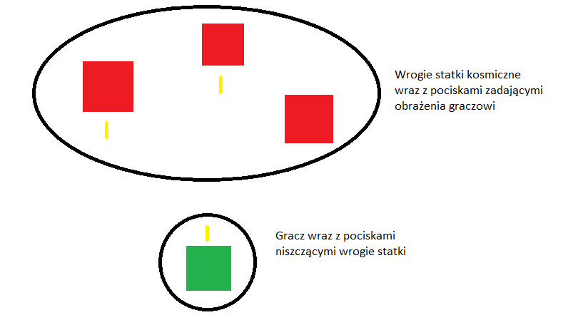

# Space Invaders
Gra polegająca na zestrzeleniu jak największej ilości wrogich statków kosmicznych.
## Instalacja
```
pip install pygame
```
## Uruchomienie

```
python main.py
```

## Koncepcja


## Wątki
- Player - wątek reprezentujący gracza.
- Enemy - wątek reprezentujący wrogi statek kosmiczny(dla każdego osobny wątek)
- Bullet - wątek reprezentujący pocisk gracza i wrogiego statku(dla każdego osobny wątek)
- Wątki dla kolizji:
  - EnemiesBulletsCollisions - sprawdzający kolizje pomiędzy graczem a wrogimi pociskami
  - PlayerBulletsCollisions - sprawdzający kolizje między pociskami gracza a wrogimi statkami kosmicznymi
  - PlayerEnemiesCollisions - sprawdzający kolizje między graczem a wrogimi statkami kosmicznymi

## Sekcje krytyczne
- blokująca możliwość aktualizacji pozycji podczas sprawdzania kolizji(gracz-wróg, gracz-wrogi pocisk, wróg-pocisk gracza), typ muteks
- blokująca możliwość inkrementacji zmiennej score podczas kolizji(gracz-wróg, wróg-pocisk gracza), typ muteks
- blokująca mozliwość dekrementacji żyć gracza podczas kolizji(gracz-wróg, gracz-wrogi pocisk), typ muteks
## Jak grać
Klawisze służą starzałek do poruszania statkiem.
Spacja do strzelania.


## Credits
www.kenney.nl